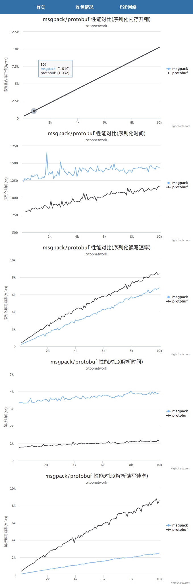

# guide
using similar struct and similar fields as xtopchain to do bench-test;

bench target is msgpack, protobuf

we will do three times for each target, and each time set different chain-binary-data(300B, 1KB, 10KB, 50KB)

# usage

```
$ make
$ ./bench --help
```


# test result
bench test in 4 core 8G machine.


# conclusion

## alloc memory

msgpack  <  protobuf

**msgpack is best**, but almost close, little difference!

## cpu
statictis not very precise, just using linux command `top`.

msgpack, protobuf cpu 100%

## performance

msgpack < protobuf

protobuf better!


## pdf 

