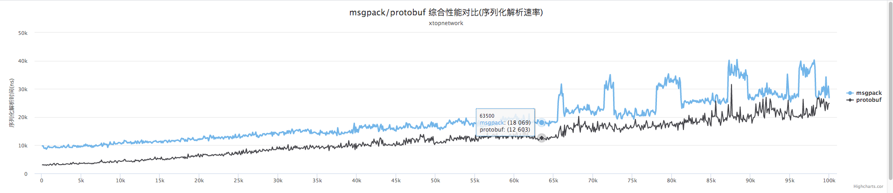
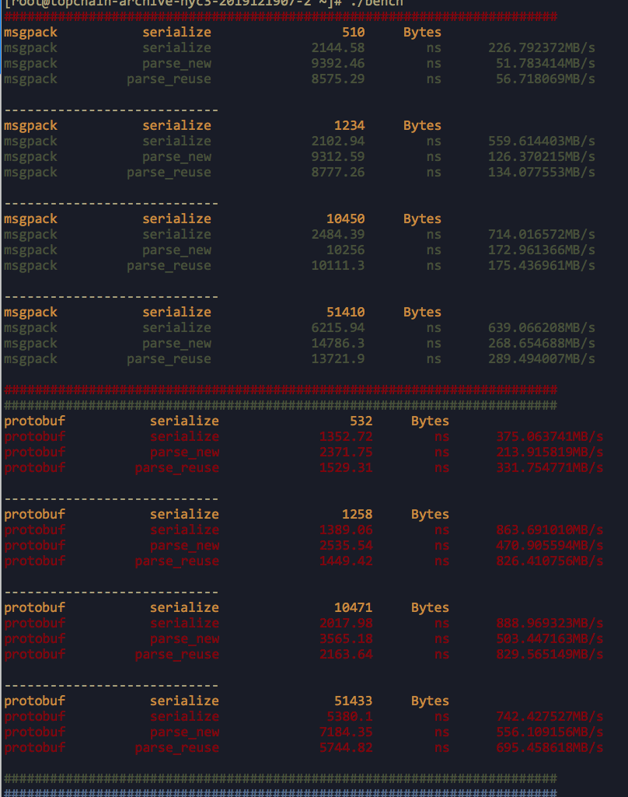
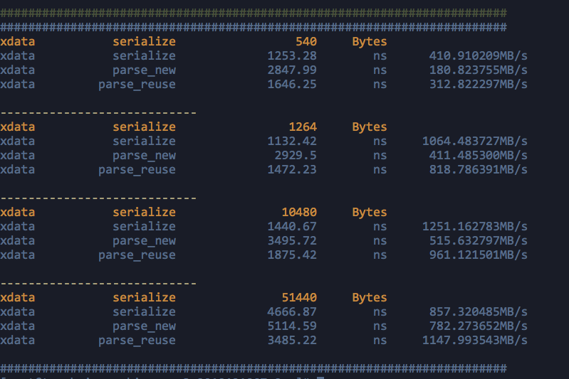

# guide
using similar struct and similar fields as xtopchain to do bench-test;

bench target is msgpack, protobuf and xbase(xdata)

we will do three times for each target, and each time set different chain-binary-data(300B, 1KB, 10KB, 50KB)

another test is compatibility of protobuf.

# usage

```
$ make
$ ./bench --help
```


# test result
bench test in 4 core 8G machine.

**pay attention to the first graph, serialize time + parse time is y. xbase is best, msgpack is worst!**






# conclusion

## alloc memory

msgpack  <  protobuf < xdataunit

**msgpack is best**, but almost close, little difference!

## cpu
statictis not very precise, just using linux command `top`.

msgpack, protobuf, xdataunit  cpu 100%

## performance

msgpack < protobuf <  xdataunit

**xdata is best**, little difference with protobuf, msgpack is worst! 

## compatibility of protobuf
compatibility of protobuf is very good, you can remove or add field as will

but keep one thing in mind, make sure the number(id) increase by degrees if you want to add field, you can not make the number(id) same
